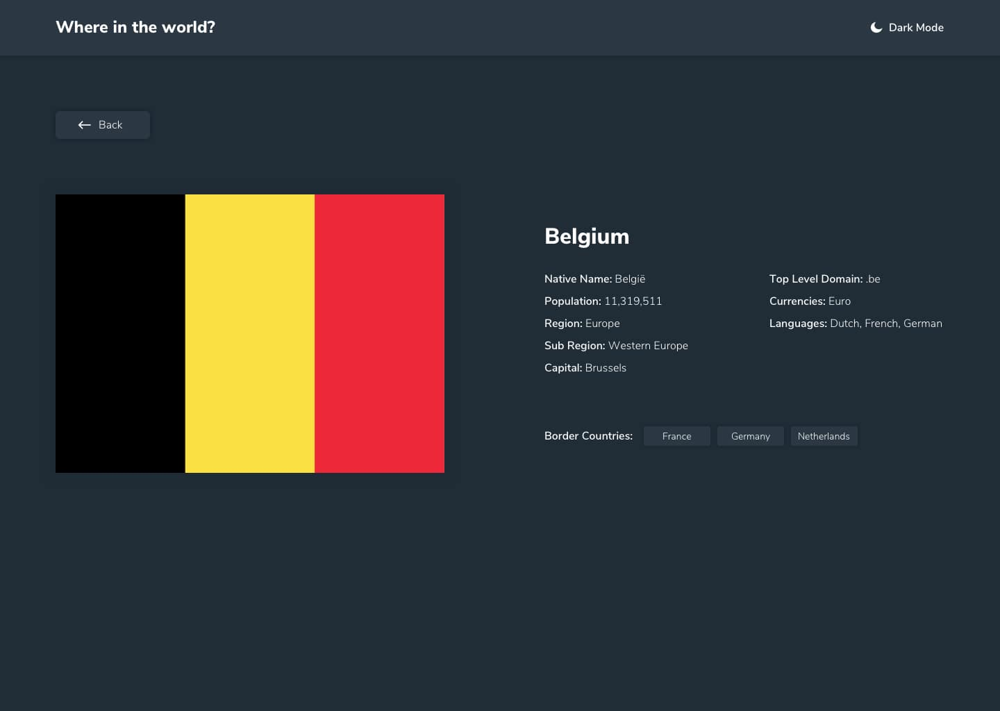

# Rest-Countries with theme switcher

This is an app built with ReactJs. 

## Table of contents

- [Overview](#overview)
  - [The challenge](#the-challenge)
  - [Screenshot](#screenshot)
  - [Links](#links)
- [My process](#my-process)
  - [Built with](#built-with)
  - [What I learned](#what-i-learned)
  - [Useful resources](#useful-resources)
- [To use](#usage)

## Overview

### The challenge

Users should be able to:

- View the optimal layout for the site depending on their device's screen size
- See all countries from the API on the homepage
- Search for a country using an `input` field
- Filter countries by region
- Click on a country to see more detailed information on a separate page
- Click through to the border countries on the detail page
- Toggle the color scheme between light and dark mode

### Screenshot





### Links

- Solution URL: (https://github.com/faozziyyah/rest-countries)
- Live Site: (https://faozziyyah.github.io/rest-countries/)

## My process

### Built with

- JSX
- CSS
- Flexbox
- [React](https://reactjs.org/) - React: JS library
- React-FontAwesomeIcon

### What I learned

- How to use rest countries api in React
- React hooks
- Theme switcher with reactjs

```React.js
useEffect(() => {
      const fetchCountries = async () => {
        const response = await fetch(url)
        const countries = await response.json()
        setCountries(countries)
        setIsLoading(false)
      }
  
      fetchCountries()
    }, [ ])
```

### Useful resources

- [REST Countries V2 API](https://restcountries.com/#api-endpoints-v2) - Rest Countries API documentation

## Usage

To use this app, you can clone this repo to your local machine, then yarn install to install dependencies and yarn start to view live on your localhost.